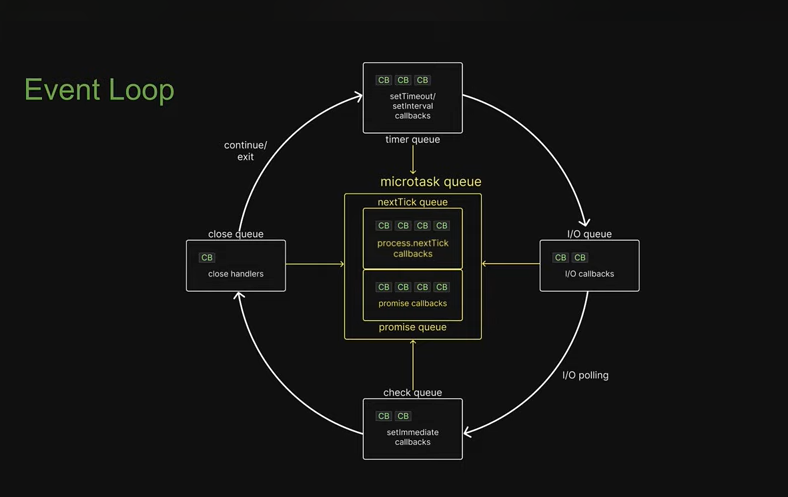

#### Event Loop

- Javascript is single threaded language, then how the JS execute the asychrounus function?
- `The event loop is what allows Node.js to perform non-blocking I/O operations — despite the fact that JavaScript is single-threaded`
- Microtask Queue are not part of libuv.
- Microtask Queue are checked before every other phase.
- Other phase are in order of `Timer --> I/O --> Check --> Close`
    - In timer phase, after every callback execution the microtask queue is checked and executed and execueted in FIFO order